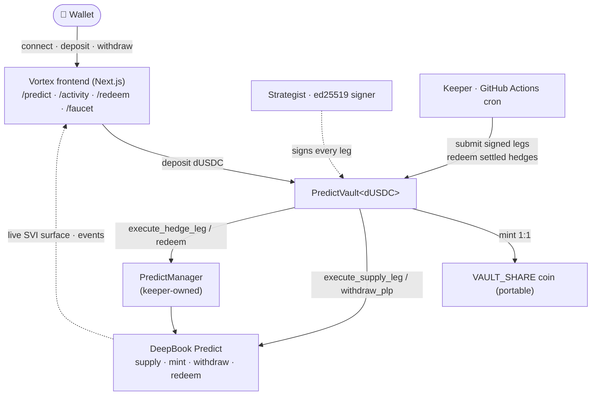
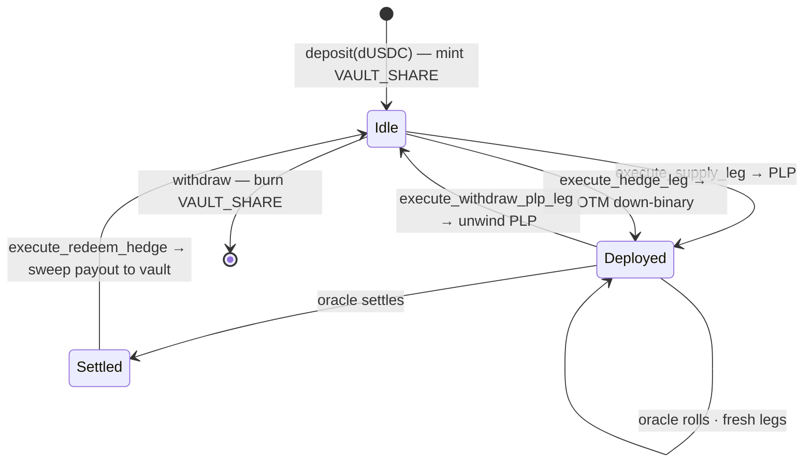
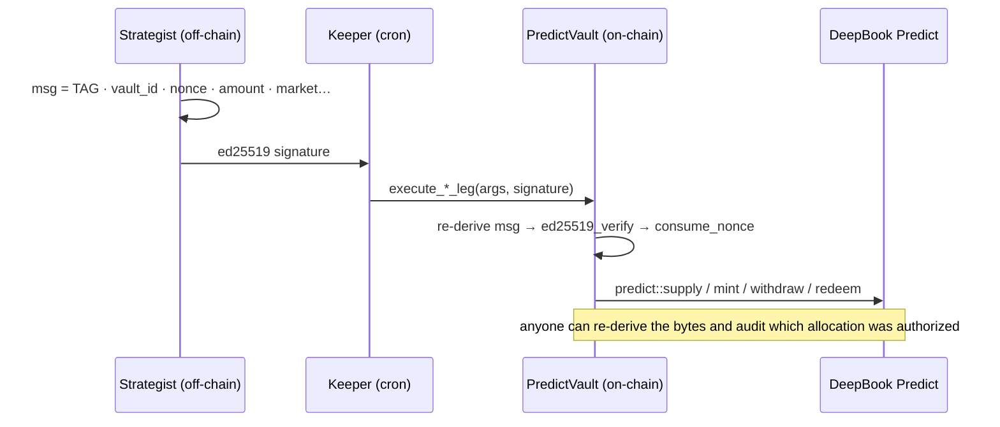

<div align="center">


# Vortex

**PLP yield, minus the crash.** &nbsp;A structured-yield vault on Sui's **DeepBook Predict** —
earn the LP maker spread, hedged against left-tail drawdown, with every allocation verifiable on-chain.

[](https://vortex-sui.vercel.app)
&nbsp;
&nbsp;
&nbsp;
&nbsp;
&nbsp;

[Live demo](https://vortex-sui.vercel.app) · [Architecture](#architecture) · [How it works](#how-it-works) · [Deployment](#live-testnet-deployment) · [Quick start](#quick-start) · [Keeper](#keeper-automation)

</div>

---

## The pitch

**The problem.** Supplying DeepBook Predict's pool (PLP) earns a steady maker spread — but one BTC
gap-down wipes the LP's left tail. Great carry, ugly crash. That tail risk is exactly what keeps
serious LPs out of prediction-market liquidity.

**The solution.** Vortex is a **one-deposit vault** that earns the PLP spread **and** spends a sliver
on out-of-the-money BTC puts as crash insurance — *PLP yield, minus the crash*. You hold a portable
`VAULT_SHARE` coin: bounded drawdown, composable across Sui DeFi.

**Why it wins.** Most Predict entries are dashboards, analytics, or concepts. Vortex is a **deployed,
working vault** where:
- every allocation is **ed25519-signed and verified on-chain** — *yield you can audit*, not a black box;
- the full **deposit → supply → hedge → settle → redeem → withdraw** cycle runs **on-chain** (verified digests in [DEMO.md](DEMO.md));
- a **keeper runs unattended** on GitHub Actions — redeeming settled hedges and rolling fresh ones every 30 minutes;
- it's **live today** — frontend on Vercel, vault on Sui testnet.

**Live proof.**
- 🌐 Demo — **[vortex-sui.vercel.app](https://vortex-sui.vercel.app)**
- ⛓️ Vault `0xa45ebd…1314f3` · Package `0x185d97…266e83` (Sui testnet)
- 🧾 End-to-end run (deposit / supply / hedge / redeem digests) — **[DEMO.md](DEMO.md)**

**The tech.** A single dependency-light Move package (`vortex_predict::vault`) composing
`predict::supply / mint / withdraw / redeem_permissionless`; a Next.js real-on-chain frontend; an
unattended keeper. See [Architecture](#architecture) and [How it works](#how-it-works) below.

**The ask.** Judge it on the bar that matters for a *product*: **does it actually work on-chain, and
can you trust the strategy?** Vortex answers both — verifiable, live, automated.

---

## TL;DR

Raw PLP (supplying the Predict pool) earns a steady maker spread but wears the **full left tail**
when BTC gaps down. **Vortex** wraps it in a bounded-drawdown shell:

| Leg | Earns | Costs | Net effect |
| --- | --- | --- | --- |
| **Supply** → `predict::supply` | PLP maker spread | — | steady carry |
| **Hedge** → `predict::mint` | — | small premium | OTM BTC put = crash insurance |
| **= Vortex** | most of the yield | a slice of carry | **bounded drawdown** — an easier sell to outside LPs |

Your position is a portable **`VAULT_SHARE`** coin — composable across Sui DeFi. Every strategy
leg is authorized by an **ed25519 strategist signature, verified on-chain**: *yield you can audit.*

---

## Architecture



The frontend (deployed on Vercel) is **read-only-real**: it reads vault state, the public indexer,
and on-chain events. The **keeper** runs separately (GitHub Actions) and holds the signing keys —
they never touch the frontend.

---

## How it works



1. **Deposit.** `vault::deposit` takes dUSDC and mints `VAULT_SHARE` (par; NAV/yield tracked off-chain). Shares are a normal `Coin`, portable across Sui DeFi.
2. **Supply leg.** Strategist signs `0x01 | vault_id | nonce | amount`. The vault verifies the signature, splits idle dUSDC, calls `predict::supply`, and banks the returned `Coin<PLP>`.
3. **Hedge leg.** Strategist signs `0x02 | vault_id | nonce | oracle | expiry | strike | is_up | qty | budget`. The keeper (which owns the `PredictManager`) funds the manager and calls `predict::mint` for a deep-OTM **down** binary — pays $1/contract if BTC gaps through the strike.
4. **Settle & redeem.** After an oracle settles, `execute_redeem_hedge` calls `predict::redeem_permissionless` and sweeps the payout back into the vault.
5. **Withdraw.** `vault::withdraw` burns `VAULT_SHARE` for the proportional claim on idle dUSDC (deployed capital is unwound by the keeper first, keeping withdrawals trustless).

### Verifiable strategy — the differentiator

The strategist can **never move funds arbitrarily**. Each leg carries an ed25519 signature over an
exact, domain-separated tuple, re-derived and verified on-chain, with a strictly-increasing nonce.



Byte layouts in `lib/predict/strategist.ts` match `vortex_predict::vault` exactly.

---

## The app

A focused, **real on-chain** interface — every figure is read from the vault object, the public
indexer, or live events. → **[vortex-sui.vercel.app](https://vortex-sui.vercel.app)**

| Route | What it does | Source |
| --- | --- | --- |
| `/predict` | Deposit / withdraw dUSDC · live **SVI vol smile** + strike ladder · vault composition (idle / PLP / hedge / shares) | vault object + indexer + wallet |
| `/activity` | Live **on-chain event feed** — deposit / supply / hedge / unwind / redeem / withdraw, filterable, each linking to Suiscan | `queryEvents` |
| `/redeem` | Open hedge positions · **keeper-gated** redeem of settled positions | manager indexer + on-chain |
| `/faucet` | Mint testnet tokens | on-chain mint |

The **supply / hedge / unwind / redeem** legs are not user buttons by design — they are
strategist-signed and run by the keeper, which is exactly what makes the strategy auditable.

---

## Live testnet deployment

| Component | ID |
| --- | --- |
| **Vault package** `vortex_predict` | `0x185d97299f82a6380e99779eaed8a51833dada528c05b39e3f537eb01a266e83` |
| **PredictVault\<dUSDC\>** (shared) | `0xa45ebd4f8c87d7c3d1e4cfe20adb4de9594aa5439bb703685facc7bb7c1314f3` |
| Keeper-owned **PredictManager** | `0xd38f54d9dbeba98121e81ab39fddd559e2b63577ceecf5404a1e63ad90c9b0fb` |
| `VAULT_SHARE` TreasuryCap (held by vault) | `0x7cfeecdbea4c0dbe0815c9b36f7d916e3650e2b2a08acd51a78b898f3fa01342` |

Composing against the live **DeepBook Predict** protocol (branch `predict-testnet-4-16`):

| Component | ID / value |
| --- | --- |
| Predict package | `0xf5ea2b3749c65d6e56507cc35388719aadb28f9cab873696a2f8687f5c785138` |
| Predict shared object | `0xc8736204d12f0a7277c86388a68bf8a194b0a14c5538ad13f22cbd8e2a38028a` |
| dUSDC quote asset | `0xe95040085976bfd54a1a07225cd46c8a2b4e8e2b6732f140a0fc49850ba73e1a::dusdc::DUSDC` |
| Public indexer | `https://predict-server.testnet.mystenlabs.com` |

Network: **Sui Testnet**. Get testnet dUSDC via the DeepBook form: https://tally.so/r/Xx102L
(dUSDC is **not** the normal testnet USDC.) A funded `deposit → supply → hedge → redeem` cycle has
been run on the shared vault — verified tx digests are in **[DEMO.md](DEMO.md)**.

---

## Simulation

`SIMULATION.md` (generated by `scripts/simulate-plp-hedge.mts`) back-tests on **~2,000 real settled
BTC expiries** from the public indexer. Representative result:

| Strategy | APY | Max drawdown · calm / 3× vol stress |
| --- | --- | --- |
| Raw PLP | ~+20% | ~0.05% / ~2.6% |
| **PLP + Hedge** | ~+13% | **~0.03% / ~1.0%** |

The hedge gives up a slice of carry to **roughly halve the left tail** — and the gap widens sharply
under stress. (BTC move series is real; PLP PnL is modeled as carry minus short-gamma loss.)

---

## Quick start

### Frontend

```bash
cd vortex-interface
npm install
npm run dev      # http://localhost:3000  →  Connect Wallet  →  /predict
```

Defaults in `lib/predict/config.ts` already point at the live deployment — **no env needed**.
Connect a wallet, request dUSDC (form above), then deposit. Live build: **[vortex-sui.vercel.app](https://vortex-sui.vercel.app)**.

### Move package

```bash
cd contracts/vortex_predict
sui move build      # links against the deployed Predict package
sui move test       # on-chain ed25519 verification (incl. RFC 8032 vector)
```

> `setup-dep.sh` patches the cached `deepbook_predict` dependency with `published-at = 0xf5ea…5138`;
> publish with `--allow-dirty`.

---

## Keeper automation

The strategy legs are signed off-chain and submitted by a keeper — run it manually or unattended.

```bash
cd vortex-interface
npx tsx scripts/keeper.mts status                  # read vault + live oracles
npx tsx scripts/keeper.mts supply 5                # supply 5 dUSDC → PLP
npx tsx scripts/keeper.mts hedge 1 0.5 0.1         # mint OTM-down hedge (budget, OTM%, qty)
npx tsx scripts/keeper.mts unwind                  # unwind PLP back to idle
npx tsx scripts/keeper.mts redeem-settled          # redeem every settled-but-open hedge
```

`.github/workflows/keeper.yml` runs `redeem-settled` + a fresh hedge **every 30 minutes** on GitHub
Actions (idea-bank #8 settled-redeem keeper). Keys live in repo **Secrets** (`DEPLOYER_MNEMONIC`,
`STRATEGIST_SK`) — never in the frontend. The frontend (Vercel) and the keeper (Actions) are fully
decoupled.

---

## DeepBook Predict track — minimum requirements

- ✅ **Integrates the Predict contract on testnet** — `vortex_predict::vault` calls `predict::supply / mint / withdraw / redeem_permissionless` on the live package.
- ✅ **Works end-to-end** — deposit → signed supply/hedge legs → settle/redeem → withdraw, via the `/predict` UI + keeper; verified digests in **[DEMO.md](DEMO.md)**.
- ✅ **Simulation result** — `SIMULATION.md`, from real settled BTC history.

Also ships a **live SVI surface viewer** (`/predict`), a **settled-redeem keeper** (`/redeem` + cron),
an **on-chain analytics feed** (`/activity`), and a **tokenized share** (`VAULT_SHARE`).

---

## Repo layout

```
contracts/vortex_predict/      # the Predict vault package (this submission)
  sources/vault.move            # deposit/withdraw + signed supply/hedge/unwind/redeem legs
  sources/vault_share.move      # VAULT_SHARE tokenized share coin
  tests/vault_tests.move        # shares, NAV-on-idle withdraw, ed25519 verify
vortex-interface/              # Next.js app (real on-chain) + keeper
  app/predict|activity|redeem|faucet
  lib/predict/                  # config, indexer client, SVI math, tx builders, strategist signer
  scripts/keeper.mts            # sign & submit legs, redeem settled hedges
  scripts/simulate-plp-hedge.mts
.github/workflows/keeper.yml    # unattended keeper (cron)
contracts/vortex/              # prior work: Vortex order-book lending protocol (separate)
```

---

<div align="center">

Built for **Sui Overflow · DeepBook Predict track** — *yield you can audit.*

</div>
